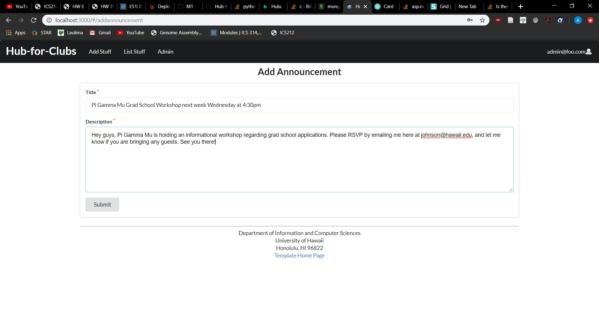

## Table of contents

* [Overview](#overview)
* [User Guide](#user-guide)
* [Developer Guide](#developer-guide)
* [Development History](#development-history)
* [Acknowledgements](#acknowledgements)


## Overview 

[Hub for Clubs](https://hub-for-clubs.meteorapp.com/) is a web application that provides a centralized directory for UH Manoa student clubs. UH Manoa students can login to browse a well organized directory of all current student clubs, with brief descriptions, meeting times and locations, URLs to their websites (if any), contact information for officers, and a few select photos. This project utilizes the following technologies:

* [Meteor](https://www.meteor.com/) for Javascript-based implementation of client and server code. 
* [React](https://reactjs.org/) for component-based UI implementation and routing.
* [Semantic UI React](https://react.semantic-ui.com/) CSS Framework for UI design.
* [Uniforms](https://uniforms.tools/) for React and Semantic UI-based form design and display.

## User Guide

This section provides a walkthrough of the Club Hub user interface and its capabilities. 

### Landing Page


The landing page is presented to users when they visit the top-level URL to the site. A rotating belt of three featured clubs is located at the bottom of the page. These clubs are randomly selected from a RIO list.

### Navbar

Users that are not logged in are presented with a navbar, containing links to the following pages:
* [Home]
* [Club Explorer]
* [Random Club]
* [Sign up/Sign in]

### Sign in


Should a user already have an account registered with Club Hubs, he/she can simply click on the "Sign in" button located on the upper right corner of the navbar to access the above page. 
 
Alternatively, a user can select the "Sign up" button either on the sign in page itself or the navbar to go to the following page and register as a new user.

### Sign up 

Fill the sign up form with a user’s name, email, and password. The user’s inputted name will be his/her username displayed on their member profile.

### User page


  
After logging in, users are taken to your profile page, which presents a form on the left side where they can complete and/or update their personal information:
* Profile Image: submit a link on the internet to the image the user wants as their profile image
* Interests: type in interests or pull interests from the drop down list. 
* Majors: type in majors or pull majors from the drop down list.

Once a user has interests and/or majors associated with their profile, they can then view the recommended clubs tab in their profile page (located to the right of the page). The recommended clubs tab recommends you clubs based on your inputted interests and majors. 

By clicking on a club, users are brought to the club page where they can join, favorite, and find more information about the club. Joined and favorited clubs will be listed on a user’s profile.

Upon joining a club, users can view their joined club’s announcements on their profile. Otherwise, if they want to see global announcements, they can access the Announcements Board on the navbar.

### Announcements Board

If users want to discover more active clubs, they can view all announcements from all UH Manoa clubs on this page.

### Club Explorer page

The Club Explorer page displays all current clubs at UH Manoa. Users can search for a specific club using the search bar or select a category. Users can select and combine multiple categories. For example, if a user wants to view clubs that have both “art” and “technology” tags at UH Manoa, they can click “art” and “technology” on the menu. This is different from the recommended clubs on the profile page in that the results are amalgamated (i.e. the profile page shows all clubs with “art” or “technology” while the club explorer shows only clubs with both “art” and “technology”).

### Club page(s)


The Club Page contains information such as the leader’s name, website (if any), club profile image, and its associated interests. It also contains a join button and a favorite button under the name. After joining and/or favoriting the club, the button automatically transforms to “leave” and “unfavorite” should the user decide that they no longer want to be part of the club.

On the right of the page contains the club’s description (if provided), recent announcements the club has made, and a list of member profiles whose profiles you can also view. Note that you have to be signed in to view club members and access their profiles.

### Random Club

Random Club on the navbar takes you to the profile of a random club at UH Manoa, regardless of your stated interest/smajor.

### Suggested Clubs

Suggested Club takes you to the profile of a random club at UH Manoa that is related to your interests/major.

### Admin User Accounts

Admins user accounts are accounts who are leaders of a club. Admins can edit their club’s information and add announcements.

## [Add Announcement](https://hub-for-clubs.meteorapp.com/#/addannouncement)



Admin accounts can add announcements on their club page.

## Edit Announcement


An “edit announcement” option is shown beneath the announcements the admin account has made. Admins can edit their current announcements.

## Developer Guide

This section provides information of interest to Meteor developers wishing to use this code base as a basis for their own development tasks. 

### Installation

First, [install Meteor](https://www.meteor.com/install).

Second, visit the [Club Hub application github page](https://github.com/Ok-Boomer/Ok-Boomer.github.io), and click the "Use this template" button to create your own repository initialized with a copy of this application. Alternatively, you can download the sources as a zip file or make a fork of the repo.  However you do it, download a copy of the repo to your local computer.
  
Third, cd into the bowfolios/app directory and install libraries with:

```
$ meteor npm install
```

Fourth, run the system with:

```
$ meteor npm run start
```

If all goes well, the application will appear at [http://localhost:3000](http://localhost:3000). 

## Initialization

The config directory is intended to hold settings files. The repository contains one file: [config/settings.development.json].

This file contains default definitions for Profiles, Projects, and Interests and the relationships between them. Consult the walkthrough video for more details. 

## Quality Assurance

### ESLint

Hub for Clubs includes a [.eslintrc](https://github.com/bowfolios/bowfolios/blob/master/app/.eslintrc) file to define the coding style adhered to in this application. You can invoke ESLint from the command line as follows:

```
meteor npm run lint
```

ESLint should run without generating any errors.  

It's significantly easier to do development with ESLint integrated directly into your IDE (such as IntelliJ).

## Development History

The development process for Hub for Clubs conformed to [Issue Driven Project Management](http://courses.ics.hawaii.edu/ics314f19/modules/project-management/) practices. In a nutshell:
 
* Development consists of a sequence of Milestones. 
* Each Milestone is specified as a set of tasks.  
* Each task is described using a GitHub Issue, and is assigned to a single developer to complete. 
* Tasks should typically consist of work that can be completed in 2-4 days.  
* The work for each task is accomplished with a git branch named "issue-XX", where XX is replaced by the issue number. 
* When a task is complete, its corresponding issue is closed and its corresponding git branch is merged into master. 
* The state (todo, in progress, complete) of each task for a milestone is managed using a GitHub Project Board.

The following sections document the development history of Hub for Clubs.

### [Milestone 1: Mockup development](https://github.com/Hub-for-Clubs/Hub-for-Clubs/projects/1) 


### [Milestone 2: Data model development](https://github.com/Hub-for-Clubs/Hub-for-Clubs/projects/2) 


### [Milestone 3: Final touches](https://github.com/Hub-for-Clubs/Hub-for-Clubs/projects/3) 

## Acknowledgements

Thank you to [Phillip Johnson](https://github.com/philipmjohnson) for documentation formatting and [Branden Ogata](https://github.com/bsogata) for grading it.
